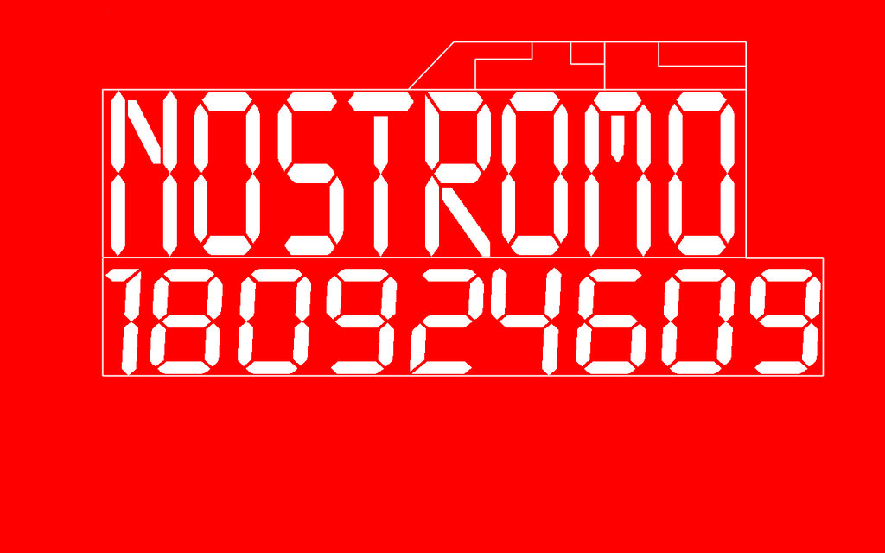

Nostromo Plymouth Theme
=======================

A Plymouth theme based on the boot screen of the computers on *Nostromo*, the
ship on which *Alien* takes place. This could be useful if you were doing some
*very* weird computer theming.

Image credit to [Quadrafox700][] on Deviantart. I removed a watermark for my
particular use case, because it really detracted from the boot screen's
immersion. I'd be glad to add it back if it's an issue.

Code credit to [Charlie Brej][]'s series on Plymouth theming. I based this on
the `mytheme` zip provided in part 2, and only customized it slightly to use a
different image. No license was included, and my changes were only minor. As a
result I'm putting this under the GPL, which gives the most freedom and credit
back to the original author.

[Quadrafox700]: http://quadrafox700.deviantart.com/art/Nostromo-boot-screen-127110997
[Charlie Brej]: http://brej.org/blog/?p=174
